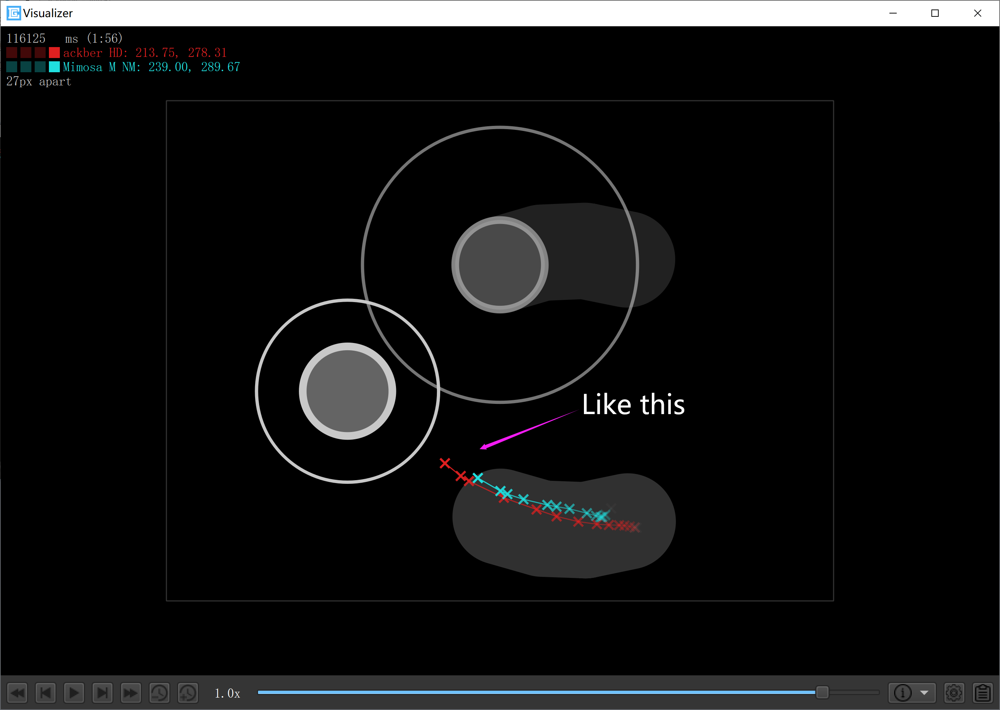

# osu replay connector

A tool for stitching (connect) multiple players' replay files when `relaying` beatmaps.

[中文说明](README-zh.md)

## Usage

> PS: Note that composite playback requires manual correction of `count_300` and other data (but using <a href="https://github.com/Wieku/danser-go">DANSER</a> export can avoid this problem).

```shell
usage: main.py [options]

osu replay connector by SpaceSkyNet

options:
  -h, --help            show this help message and exit
  -f FILE, --file FILE  the config file path, defaults to `./config.toml`
  -o OUTPUT, --output OUTPUT
                        the output replay path, defaults to `./merged.osr`
```

### Example

```shell
# use default config file path and output replay path
./main.py 

# use `settings.toml` as config file and `replay.osr` as output replay name
./main.py -f settings.toml -o replay.osr
```

## Configuration file

Default filename is `config.toml`.

The list of replay file paths is arranged in the chronological order of playing. It is recommended to use tools such as `Circleguard` to view the overlapped parts of the replay near the time node as the time node for stitching (it is recommended that the distance between the cursors of the two replays should not exceed one note. diameter, it is also best to choose a time period without key press)



The format of time node supports `HH:MM:SS.MS`, `MM:SS.MS`, `SS.MS`, `HH:MM:SS`, `MM:SS`, `SS`, as above` The time for Circleguard` can be written as `00.116125`.

> PS：The number of replay file path lists is one more than the number of stitched time nodes (naturally)

### Template for configuration file:

```toml
# Username in the output replay file
REPLAY_USERNAME = "ALL"
# Mods of the output replay file (HDNF, etc.)
REPLAY_MODS = "NF"
# Replay file path list
REPLAY_PATH_LIST = [
	"./test/0.osr",
	"./test/1.osr", 
	"./test/2.osr",
	"./test/3.osr",
	"./test/4.osr",
	"./test/6.osr",
	"./test/7.osr",
	"./test/8.osr",
	"./test/9.osr",
	"./test/10.osr", 
]
# Offset of the replay files(same as Global Offset)
REPLAY_OFFSETS = [0, 0, 0, 0, 0, 0, 0, 0, 0, 0]
# Stitched time node list
CUT_TIME_LIST = [
	'0:30.208', 
	'1:11.511', 
	'1:33.545', 
	'1:55.877',
	'2:16.469', 
	'2:53.918',
	'3:10.000',
	'4:13.195',
	'4:35.800', 	
]
```

